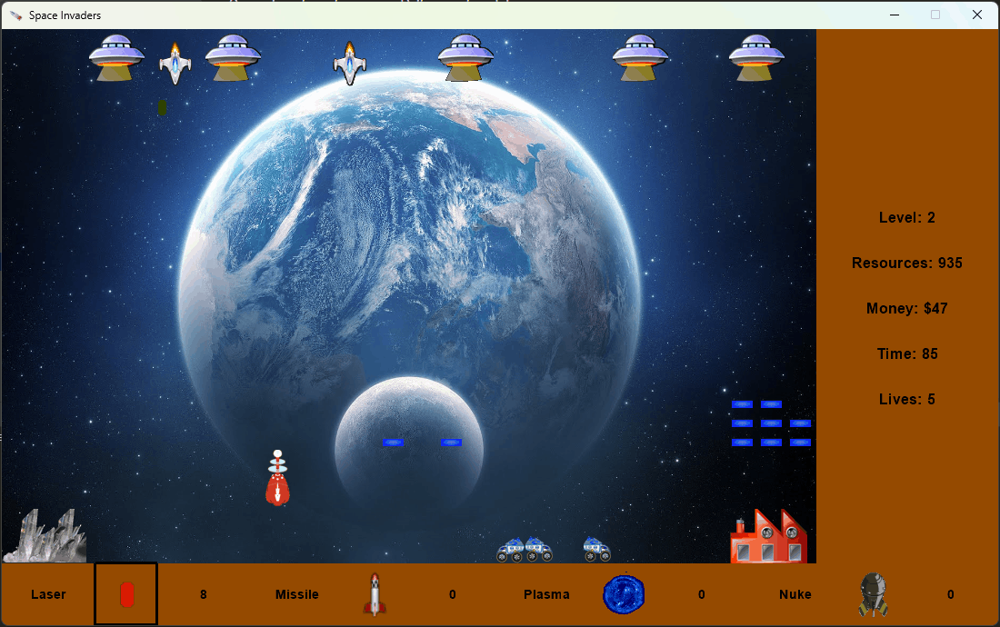

# Space Invaders 2

Space Invaders clone using Python and pyglet. This was a homework I had in
university, and I remade it 11 years later in a different language. The
original version was made in C# with WPF and can be found in
https://github.com/HenrYxZ/Space-Invaders

In this game you control a cannon, and you need to protect your base from an
alien invasion. You can use different weapons that deal different damage.
The level changes every 70 seconds and the higher the level the harder the
enemies are.

There is a mine, and you can use mining trucks to extract resources
and turn them to money when they reach the factory. You can buy new trucks with
a limit of 6 simultaneous, and new weapons. You can also buy shields to protect
the base. Be sure to protect the factory, that can be destroyed if it gets too
much damage from the enemies.

## Controls

- To move use the arrow keys.
- To build a shield and place it in front of the player use UP arrow.
- Use SPACE to shoot the current weapon.
- Change the current weapon with the numbers from 1 to 4.
- To enter or leave **buy mode** use B
- Press 0 to buy a new mining truck when you are in **buy mode**

## Dependencies

- Python
- pyglet
